## CentOS7 MySQL 셋팅

---

1. wget를 설치한다.  
   
2. net-tools를 설치한다.(ifconfig)  
   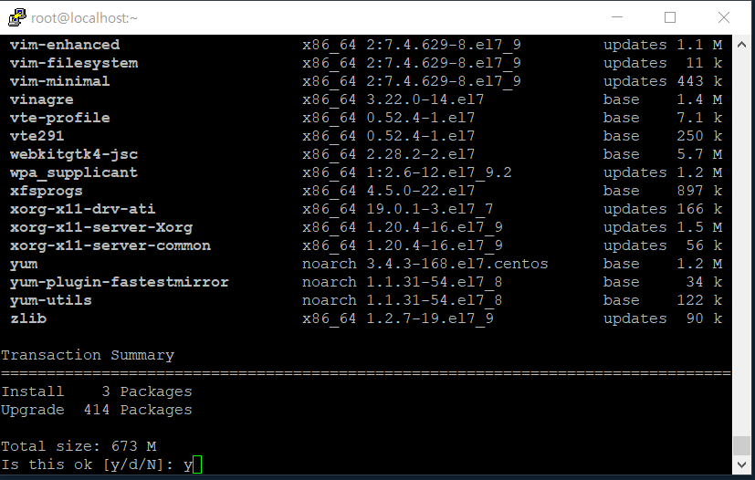
3. gcc gcc-c++설치한다. (컴파일)  
   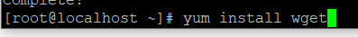
4. mysql 그룹, 계정 추가 및 mysql 다운로드  
   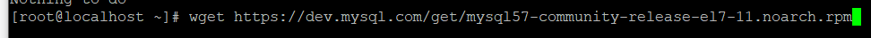
5. gz압축을 푼다.  
   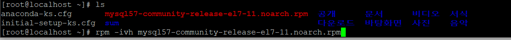
6. 압축푼 경로로 들어간다.  
   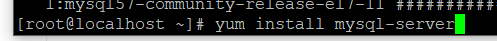
7. 옆에 코드를 입력 ./configure --prefix=/usr/local/mysql --localstatedir=/usr/local/mysql/data --sysconfdir=/etc --with-mysqld-ldflags=-all-static --with-client-ldflags=-all-static --without-debug --enable-assembler --with-charset=utf8 --with-plugins=innobase --with-extra-charsets=all  
   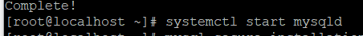
8. No curses/termcap library found 오류가 발생 시 옆에걸 설치하고 다시 한다. yum install libtermcap-devel ncurses-devel  
   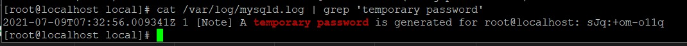
9. make / make install 입력해준다.  
   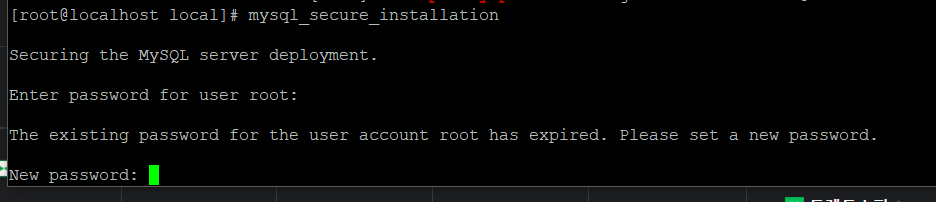
10. cp ./support-files/my-medium.cnf /etc/my.cnf 파일 이동(오버라이트 옵션이 뜬다면 y를 눌러준다.  
    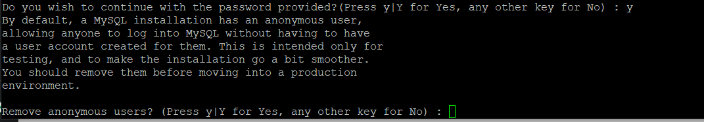
11. /usr/local/mysql/bin/mysql\*install*db 입력해준다.  
    
12. chown -R mysql.mysql /usr/local/mysql/data mysql계정에 권한부여  
    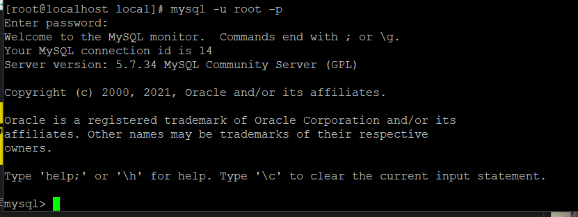
13. cp support-files/mysql.server /usr/local/mysql/bin
    chmod 755 /usr/local/mysql/bin/mysql.server
    /usr/local/mysql/bin/mysql.server start 입력
    스타트 파일을 복사하고 권한주소 서버를 시작한다.  
    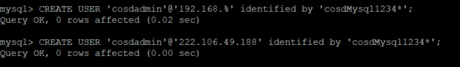
14. /usr/local/mysql/bin/mysqladmin -u root password '원하는대로' 여기서 패스워드 설정을 한다.  
    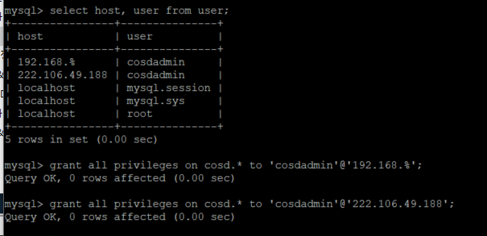
15. mysql을 실행시키고 로그인한다.  
    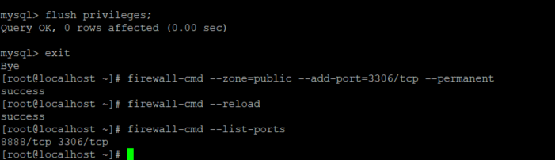
16. pkill mysqld
