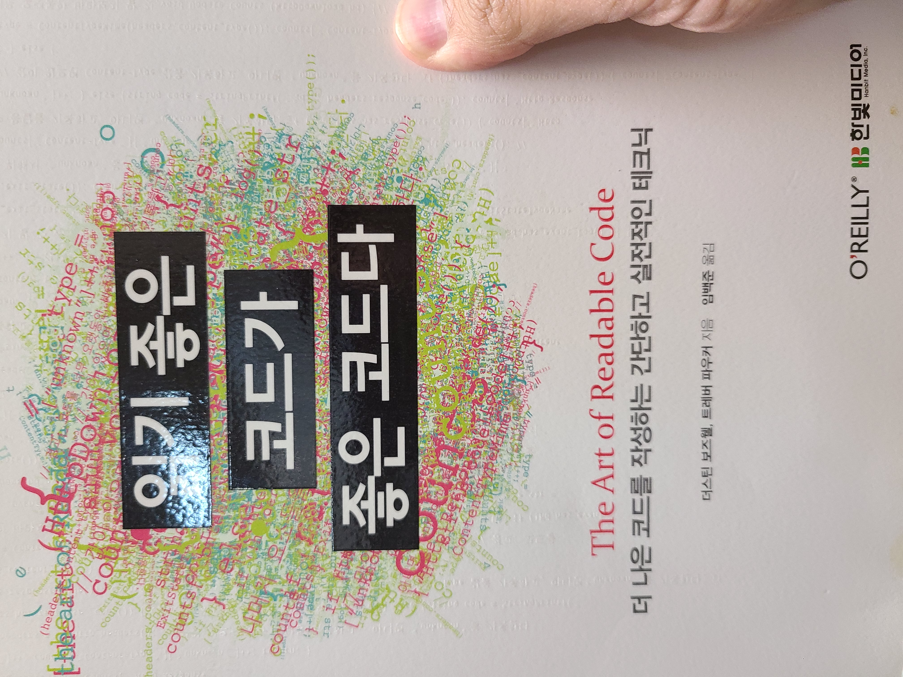

# 읽기 좋은 코드가 좋은 코드다

## 후기

> 1달 책한권 2021년 5월 읽은 책은 `읽기 좋은 코드가 좋은 코드`이다.
> 우선 책 내용자체가 읽기 쉽게, 명확하게 코드를 정리하는법인데 이 후기 자체가 매우 더럽다.  
> 다음부턴 이렇게 쓸대없이 모든내용을 정리하는데 시간을 날리는 일은 없도록 해야겟다.  
> 책내용 자체는 확실히 좋았지만 여전히 클린코드에 대해 확 잡히는 느낌은 없다. 내용중 나온것처럼 일단 해보면서 실력을 늘려야겠다.  
> 개인적으로 언어별로 책을 내던지 하나의 언어로만 했으면 좋았을것 같은데 안다루는 언어이다 보니 가독이 잘 안되는 느낌도 있었다.  
> 개발자는 무엇보다 직접해봐야 체득이 된다는걸 다시한번 느낀다.
> 다음에 리팩토링을 읽어 추가적으로 정리해봐야겠다.

---

## 1. 코드는 이해하기 쉬워야 한다.

> 간결한 코드보다 길더라도 이해하기 쉬운 코드여야 한다.

- 코드는 다른 사람이 이해하는데 들이는 시간이 최소화하는 방식으로 작성해야한다.
- 분량이 월등히 적다면 빨리 읽기 때문에 좋겠지만 한줄짜리 코드라도 이해하는데 오래걸리면 안된다.

---

## 2. 이름에 정보담기

- 특정한 단어를 사용하라 - 변수의 용도가 받아온다고 해서 Get을 사용하기 보단 같은 받아오는 의미라도 Fetch나 Download처럼 용도별로 세분화한다.
- 꼭 필요한 경우가 아니라면 temp나 retval같은 보편적인 변수명을 사용하지 않는다.(실제 사용하는 용도로 좁은범위의 sort에서 temp는 사용가능하다.)
- 조금 길어지더라도 구체적인 이름을 사용한다.
- 세부정보를 추가한다. 마이크로초로 표현할 때 ms를 붙힌다던지 다중 for문에서 i,j,k만 사용하기보단 세부정보\_i형식으로 표현할 수 있다.
- 변수가 사용되는 범위가 크다면 길더라도 자세하게 좁다면 보편적인 변수명을 사용한다.
- 대문자나 밑줄 등을 활용하라

---

## 3. 오해할 수 없는 이름들

- Filter의 경우 리스트에서 특정 데이터를 고르는 것인지 제거하는 것인지 의미가 모호할 수 있기 때문에 고르는 기능을 원한다면 select, 제거하는 기능을 원한다면 exclude가 더 좋은 선택이다.
- 범위를 지정함에 따라 초과하는 데이터를 표시할 땐 min/max를 사용하고 이상과 이하같이 포함되는 경우 first/last를 사용한다. 범위가 포함되면서도 초과된다면 begin/end를 사용한다.
- boolean 변수에 이름을 붙일때는 is, has, can, should를 붙여 의미를 더 명확하게 하고 disable 같은 부정적인 의미는 true로 오면 불분명 해지므로 피하는것이 좋다.
- get 명칭을 사용할 경우 일반적으로 캡슐화 때문에 단순변수를 리턴받는 용도로 생각할 수 있기 때문에 복잡하거나 시간이 오래걸리는 용도의 메서드에는 붙이지 않는게 좋다. size같은 명칭도 일반적으로 많이 사용되기 때문에 복잡한 메서드에는 붙이지 않는다.

---

## 4. 미학(눈을 편하게 하는 소스코드)

> - 코드를 읽는 사람이 친숙한, 일관성 있는 레이아웃을 사용
> - 비슷한 코드는 서로 비슷해 보이게 만든다.
> - 서로 연관된 코드는 하나의 블록으로 묶는다.
>   <br><br>

### 일관성과 간결성을 위해서 줄 바꾸꿈을 재정렬한다.

메서드들의 들여쓰기, 줄바꿈, 주석의 들여쓰기까지 일관성있게 해준다.  
파일 업로드를 위한 `FileUtiles(path, name, size, type)`이 있다고 해보자

```java
    FileUtiles fileUtiles = new FileUtiles(
        "fileupload", /* 경로 */
        "test.txt", /* 파일명 */
        80,/* 파일크기 */
        "text" /* 파일타입*/
    );

    FileUtiles fileUtiles2 =
        new FileUtiles(
            "fileupload", /* 경로 */
            "photo.jpg", /* 파일명 */
            500,/* 파일크기 */
            "image" /* 파일타입*/
    );
```

위 코드는 아주 안좋은 예로 같은 생성자를 사용하는 코드임에도 들여쓰기가 달라져서 일관성이 매우 떨어진다.

```java
    FileUtiles fileUtiles = new FileUtiles(
        "fileupload",   /* 경로 */
        "test.txt",     /* 파일명 */
        80,             /* 파일크기 */
        "text"          /* 파일타입*/
    );

    FileUtiles fileUtiles2 = new FileUtiles(
        "fileupload",   /* 경로 */
        "photo.jpg",    /* 파일명 */
        500,            /* 파일크기 */
        "image"         /* 파일타입*/
    );
```

위처럼 소스코드와 주석의 들여쓰기만 맞춰줘도 가독성이 올라간다. 하지만 여전히 간결함이 없는 코드이다.

```java
    // FileUtiles(경로,   파일명,  파일크기,파일타입)
    //           [path],[filename],[size],[type]
    FileUtiles fileUtiles =
        new FileUtiles("fileupload","test.txt",80,"text");

    FileUtiles fileUtiles2 =
        new FileUtiles("fileupload","photo.jpg",500,"image");
```

주석을 맨위에 적어주어 일관성있고 간결하게 정리하였다.
<br><br>

### 메서드를 활용하여 불규칙성을 정리한다.

특성 기능이 반복된다면 `해당 기능을 하는 메서드를 생성`하여 보기좋게 한다.
이를 통해 가독성만 늘릴 뿐 아니라 중복된 코드를 제거할 수 있고 예외를 한곳에서 처리함으로 한눈에 파악할 수 있다.
<br><br>

### 필요하다면 공백으로 코드의 열을 맞춘다.

아까의 파일업로드를 변수들을 정리한 VO가 있다고 생각해보자

```java
class FileUploadVO{
    private String originalFileName; // 업로드 파일명
    private String saveFileName;     // 저장된 파일명
    private int fileSize;            // 파일 크기
    private String fileType;         // 파일 타입
}
```

위처럼 주석을 달아야 한다면 변수 옆에 바로 적어주는것이 아니라 공백으로 채워 열을 맞춰 주석을 달아 줄 수 있다.  
이 외에도 매퍼에서 select, insert문을 적어줄 때 컬럼이 많으면 열이 맞지 않아 가독성이 떨어지는데 공백을 추가해주어 가독성을 올려주는게 좋다.
<br><br>

### 의미 있는 순서를 선택하여 일관성있게 적용한다.

코드를 작성함에 있어 순서가 의미없는 코드가 있다면 의미 있게 정렬하는것이 좋다.  
예를 들어 `중요한 코드순`으로 적어주던지 `알파벳 순으로` 정렬해줄 수도 있다. 중요한건 이렇게 규칙을 정하고 항상 같은 순서로 정렬 해주어야한다.
<br><br>

### 선언문은 블록으로 구성한다.

자바의 경우 인터페이스나 추상메서드를 구현한다면 선언문으로만 구성되어 있다.
이런 선언문으로 구성되어있을 경우 블록으로 구성하면 가독이 편하다.  
예를 들면 게시판을 구현하는 DAO 인터페이스를 만들어준다고 하면  
리스트나 뷰, 인설트, 업데이트 별로 블록을 구성하여 정리하거나 특정 게시판 단위로 블럭을 만들어 주석을 작성하여 관리해준다.

<br><br>

### 문단으로 쪼개어 작성한다.

이건 매우 기초적인 것이지만 코드를 작성할때 개행 없이 빡빡하게 작성하지 않고 선언하는 문단, 작업하는 문단, 체크하는 문단 등 기능별로 개행을 주어 가독이 편하게 한다.

<br><br>

### 개인적인 스타일의 일관성

괄호를 여닫는 스타일이나 주석을 다는 스타일을 개인적으로 편하게 하는건 나쁘지 않다.  
하지만 이런 스타일을 바꿔가면서 작성하면 일관성이 없어 가독이 어렵다.  
안좋은 습관으로 코딩하더라도 일관성있게 하나의 스타일로만 코딩하는것이 훨씬 더 중요하다.

---

## 주석 작성

> 주석의 목적은 코드를 읽는 사람이 코드를 작성한 사람만큼 이해를 돕는 데 있다.  
> 이번장에 다루는 내용
>
> - 주석에 포함되지 않아야 하는 것
> - 코딩을 하면서 머릿속에 있는 정보 기록
> - 코드를 읽는 사람의 입장에서 필요한 정보 유추

### 설명하지 말아야 하는 것

주석은 코드를 읽는 시간을 증가시키고 화면의 일정부분을 차지하게 된다.  
즉 주석을 달거라면 반드시 달아야하는 이유가 있어야 한다.  
예를 들면 생성자에 생성자라는 주석을 단다던가 getter, setter에 주석을 다는건 읽는 사람에게 아무런 정보를 제공하거나 이해하는데 도움을 주지 않는다.

- 코드에서 빠르게 유추할 수 있는 내용들은 주석을 달 필요가 없다. 변수명이나 함수명만 봐도 이해할 수 있다면 구지 의미를 알려주는 주석을 달아 설명할 필요가 없다.
- 함수에 주석을 단다면 단순한 설명이 아닌 세부사항을 적어주는것이 좋다.
- 만약 메서드명이나 변수명이 알기 힘들어 주석을 해야한다면 주석을 달게 아니라 변수명, 함수명을 바꿔라
  <br><br>

### 생각을 기록하라

얼핏 생각했을 떄 생각나는것을 기록하는것은 쓸때없다고 느낄 수 있지만 감독이 메이킹 필름을 만드는 것처럼 개발자의 설명은 큰 도움이 될 수 있다.  
코드를 짜면서 왜 이렇게 구현했는지 어떤 오류가 발생하여 이런 방식을 도용했는지, 하드웨어 성능에 차이가 있었다던지 개발하면서 전환점이 되었던 이런 생각들은 다른사람도 똑같은 고민을 할 여지를 없애준다.  
또 코드를 테스트하면서 발생한 버그나 주요결함은 개발자나 테스터만 알 수 있으므로 이런 사항을 기록하여 다음에 같은 실수를 반복하지 않게 한다.

> 주석에서 널리 사용하는 표시
>
> - TODO: 아직 하지않은일
> - FIXME : 오작동을 일으킨다고 알려진 코드
> - HACK : 아름답지 않은 해결책
> - XXX : 위험! 큰문제가 있다.
> - TextMate : ESC

상수이 경우에도 개발자가 아닌사람이 상수를 보면 어떤용도인지 어떻게 변경할 수 있는 옵션이 있는지 알기 어렵다. 그렇기 때문에 주석을 이용하여 용도나 변경을 원할경우 옵션을 적어주어야 한다.
<br><br>

### 코드를 읽는 사람의 입장이 되어라

코드를 읽는 사람의 입장이 되어 궁금할만한 요소는 주석을 달아줘야 한다.  
예를들어 많이 사용하는 get,set,clear등 왜 이런 네이밍을 했는지 비슷한 용도라면 왜 구지 또 만들었는지 설명을 해주어야 한다.  
이 함수를 보고 다른사람이 오해할 소지가 있는지 생각해보고 주석을 달아주어야 한다.  
통신이 필요하여 호출하면 바로 실행되지 않고 api에서 데이터를 읽어들여야 한다면 어느정도 시간이 필요하다는걸 주석에 적어야한다. 아무생각없이 그걸 호출하여 사용할 다른 개발자는 로딩이 있으면 안될 수 있기 때문이다.  
요약주석도 유용한데 코드에 줄줄이 주석을 다는게 아니라 상단에 요약하여 짧게 한번에 주석을 달아 코드를 읽기 편하게 도와줄 수 있다.  
<br><br>

### 일단 써라

주석을 적는데 있어 시간이 많이들기도 하고 복잡한 코드들은 주석도 달기 힘들기 때문에 주저할 수 있지만 일단 작성하면 나쁘더라도 정리되지 않더라도 일단 작성하고 보자 꾸준히 작성한다면 점점 더 구체적으로 작성가능할 것이다.

---

## 명확하고 간결하게 주석달기

> 주석은 최대한 구체적이면서도 자세하게 작성해야 하고 다른 개발자로 하여금 읽는 시간을 요구하므로 최대한 간결해야 한다.  
> 주석은 높은 정보 대 공간 비율을 갖춰야 한다.
> <br><br>

### 주석은 간결하게

매개변수 리턴타입 등은 한줄의 주석으로 간단하게 적을 수 있으므로 각각 설명해준다고 몇줄씩 적을 필요는 없다.
<br><br>

### 모호한 대명사는 피한다.

영어로 된 책이기 때문에 it, this같은 대명사를 사용하면 이것이 의미하는것이 뭔지 다시한번 체크해야할 우려가 있다. 한국어로 표현하다 하더라도 그것, 이것등의 대명사는 피하고 정확하게 어떤 데이터를 의미하는지 집어주는것이 좋다.
<br><br>

### 엉터리 문장을 다듬는다.

책의 예를 보면 크롤러의 예를 드는데 `이 URL을 전에 이미 방문햇는지에 따라서 다른 우선순위를 부여한다.`라는 주석을 `전에 방문하지 않은 URL에 높은 우선순위를 부여하라`로 변경한걸 보여준다.  
이는 더 간결해졌지만 더 정확하게 설명해준다. 위에 주석은 애매모호해서 읽더라도 다시한번 소스코드를 점검하게끔 한다.
<br><br>

### 함수의 동작을 명확하게 설명한다.

책에서 드는 예는 파일의 Row수를 리턴하는 함수로 예를 든다.  
이 함수의 주석은 `파일에 담긴 줄 수를 리턴한다.`이다.  
하지만 이래서는 빈파일, `\n`같은 개행문자 같은것들이 사용하는 사람으로 하여금 난해하게 만든다.  
함수의 설명은 `\n의 갯수를 반환한다.`라고 명확하게 되어있다면 주석을 읽은 사람은 정확한 용도를 알 수 있다.
<br><br>

### 입/출력 예를 이용하라

매개변수와 리턴할 데이터의 작업을 설명하게되면 주석이 너무 길어질 수 있기 때문에 어떤 데이터가 들어왔을때 어떻게 리턴되는지 실제 데이터 예시를 주석으로 넣어 쉽게 이해시켜 줄 수 있다.
<br><br>

### 코드의 의도를 명시하라

대부분의 주석은 코드가 수행하는 동작이 무엇인지 설명하는데 그치는데 개발자가 무슨의도로 해당 동작을 이용하는지 적어주는것이 좋다.  
책의 예는 `리스트를 역순으로 반환` 이라는 주석이 있고 `높은 값에서 낮은값 순으로 나타낸다`는 주석이 있는데 앞에 역순으로 반환은 어떻게해도 맞기 때문에 해당 기능이 틀렸는지 알기 어렵지만 뒤의 주석은 낮은값부터 정렬된다면 바로 틀렸다는걸 알 수 있게끔 명확하다.
<br><br>

### 이름을 가진 함수 파라미터 주석

매개변수의 주석을 달때 JS처럼 `/*name=*/`로 해당 데이터가 어떤 의미인지 알려준다면 다른 사람이 볼때 파악하기 쉬울것이다.
<br><br>

### 정보 축약형 단어를 사용하라

길게 늘어지는 주석을 달아야 할 것 같다면 개발자들이 많이 사용하는 용어들로 짧게 축약해서 적는것도 좋다. 예를들어 캐쉬계층, 표준화 같은 단어로 줄줄이 적어야할 내용을 축약할 수 있다.

---

## 읽기 쉽게 흐름제어 만들기

> 흐름을 제어하는 조건문, 반복문을 최대한 자연스럽게 만들도록 노력해야한다.
> 조건문과 반복문은 코드를 복잡하게 만드는 원인이며 어렵게 만든다면 코드를 읽다가도 다시 되돌아가서 읽어야 할 것이다.

### 조건문에서 인수의 순서

if문을 작성할 때 변수와 정해진 숫자를 비교한다면 그냥 변수를 앞에두는것이 편하다. `if(list.size() < 10)` 같이 변수가 앞으로 오는것이 보기 편하다는 의미이다.  
|왼쪽|오른쪽|
|:--|:--|
|값이 더 유동적인 질문을 받는 표현|더 고정적인 값으로 비교대상으로 사용되는 표현|
간단하게 생각하면 변수가 앞에오고 정해진 숫자가 뒤에 온것처럼 증가하거나 변하는 값이 앞에오고 기준이되는 값이 뒤에오는게 보기편하다.
<br>

### if/else 블록의 순서

if와 else의 경우 순서를 자유롭게 바꿀 수 있다.  
예를 들어 `if(delStat == 1)` 을 정의한다면 else는 1이 아닌 값이 올 경우겠지만 `if(delStat != 1)` 로 정의해도 전혀 이상하지 않기 때문에 지금까지는 별 고민없이 생각나는대로 작성하였다.  
이런 if문 블록의 순서도 정리해야 한다.

> - 부정이 아닌 긍정부터 즉 위의 예시에서 !가 들어가지 않는걸 하는것이 좋다.
> - 간단한 로직부터 처리해야 if와 else문을 같은 화면에 표시할수도 있어 보기 좋다.
> - 더 주요기능인것 부터 처리한다.

<br>

### 삼항연산자

`조건문 ? true일 경우 : false일 경우`로 하는것을 삼항연산자라고 하는데 이렇게 사용하는것을 두고 한눈에 볼 수 있어 좋다는 의견과 이해가기 어렵다는 의견들이 있어 논란이 있다.  
만약 조건문 ? 이후 true건 false건 처리하는 코드가 매우 짧은 간단한 것이라면 삼항연산자는 보기 편하고 쓸대없이 중복되는 코드를 작성하지 않아도 되어 좋다.  
하지만 삼항연산자의 조건 이후 코드가 수식이 들어간다던가 복잡하다면 이는 if/else로 나누는것보다 가독성이 훨씬 떨어진다.  
코드작성을 꼭 한줄로 처리할 필요가 없으므로 매우 간단한 경우가 아니라면 삼항연산자의 사용은 자제하는것이 좋다.
<br><br>

### do ~ while 문은 피한다.

do while문은 여타 반복문하고는 다르게 코드가 한번 실행 된 후에 조건을 본다. 그렇기 때문에 다른 반복문에 피해 개발자가 착각하기 쉽고 특히 continue같은걸 사용하면 더 혼동이 온다.  
while문만 사용해도 do while문처럼 사용하는게 불가능하지 않으므로 되도록 사용하지 않도록 한다.
<br><br>

### 함수의 중간에서 반환하기

함수 중간에 리턴문을 넣어 여기저기서 리턴하는것을 우려하는 개발자도 있지만 try~catch문같은 예외처리문을 사용한다면 리턴문을 여러번 넣는것은 전혀 문제가 되지 않는다.
<br><br>

### goto

goto의 경우 어쩔 수 없이 사용해야하는 C언어가 아니라면 사용하지 않는게 좋고 C언어에서 사용하더라도 최대한 적은 포인트를 사용해야 한다.
<br><br>

### 중첩을 제거한다.

개발을 하다보면 if문을 중첩하는일이 많다. 이런경우 다시 볼 때 해당 코드를 이해하기가 매우 어렵다.  
이를 해결하기 위해 함수 중간에서 반환하여 중첩을 제거한다던가 반복문안에서는 continue를 이용하여 중첩시키지 않고 처리가 가능하다.  
솔직히 내가 실제 코딩에서 사용할정도로 공감은 되지 않아 다시한번 살펴 봐야겠다.
<br><br>

### 실행흐름을 따라올 수 있는가?

지금까지 언급한 것을 반복문, 제어문상에서의 흐름을 제어하는것으로 최하위 수준에서의 제어를 살펴보았다.  
하지만 프로그램의 흐름은 매우 크므로 상위수준에서 조망해보아야 한다.  
프로그램의 전체 실행 경로를 쉽게 따라갈 수 있게 만드는것이 궁극의 목표인 것이다.
하지만 솔직히 내가 개발하는 웹에서는 메인도 하나의 흐름도 딱히 존재한다고 생각하지 않아서 크게 의미가 있을지 모르겠다.  
다음 프로젝트에서 유스케이스 작성 시 한번 흐름에 대해 다시한번 생각해 봐야겠다.

---

## 거대한 코드 잘게 쪼개기

### 설명변수를 도입한다.

개발을 하다보면 한줄에 모든걸 처리하고 싶을때가 있다.  
그래서 복잡하게 VO에서 날짜 데이터를 GET해서 이걸 substring로 연도만 자르고 그걸 if문에서 비교해주는 등의 행위를 한줄에 처리할 수도 있지만 이는 다른사람이 봤을때 이해하기 힘든코드이다.  
이를 설명하기 위해 변수를 하나 생성해서 연도를 받아주고 이를 if문에서 비교한다면 1줄에 처리를 못하더라도 간결하고 보기 편할 것이다.  
<br>

### 드모르간 법칙을 응용한다.

여기서 드모르간 법칙이 나올지는 몰랐는데 읽어보니 유용할법 하다.  
드모르간 법칙은 길게 이어진 논리식을 줄여줄 수 있는데 개발을 하다보면 if문에 온갖 논리조건이 이어질 수 있는데 이를 !을 빼주면서 `()`로 감싸주면 길이를 엄청나게 줄일 수 있다.(이해는 더 어려워 질 수 있을 것 같다.)  
<br>

### 쇼트 서킷논리를 오용하지 않아야 한다.

if문에서 or 즉 ||를 처리하는 방식은 or 앞에오는 논리식이 참이라면 뒤를 평가하지 않는데 이를 쇼트 서킷 논리라고한다.  
여기서 조심해야 한다는것은 중요한 조건식을 앞에 둬야한다던가 꼭 체크해야할 논리식을 넘어갈 수 있기 때문에 여러 조건식이 ||를 넣으면서 이어진다면 최대한 줄여야 리스트를 줄일 수 있을 것이다.
<br>

### 거대한 구문 나누기

javascript에서 작업을 하다보면 바닐라js로 name들로 객체를 호출하거나 jquery로 $(선택자)를 이용하여 객체를 호출하는데 그러다 보면 자연스럽게 코드가 길어진다.  
물론 직접 개발하고있다면 이렇게 매번 선택자를 이용하여 호출해도 무엇을 작업하는지 따라갈 수 있을것이다. 하지만 추후에 보거나 다른 개발자가 보면 너무 거대한 코드에 가독이 힘들 것이다.  
길어진 코드는 앞에 설명변수를 언급한것처럼 하나의 변수를 만들어 자주 호출되는 객체를 따로 정의해주고 마찬가지로 반복되는 작업을 하나로 묶어 함수로 만들어 준다.  
C++의 경우에도 매크로 기능을 사용하여 자주 사용하는 기능을 묶어 거대한 코드를 나눠주는것이 가능하다.

---

## 변수와 가독성

### 변수 제거하기

앞장에서 요약변수의 중요성을 알아보았는데 요약변수는 아무렇게나 작성한다고 요약되는것이 아니다.  
예를들어 날짜를 불러올때 많은 개발자들이 now라는 변수를 만들어 현재 시간을 받아온다. 하지만 now변수는 자주 사용되지 않고 호출하는 datatime객체도 복잡하지 않고 명확하기 때문에 구지 now변수를 선언하여 작업하지 않아도 쉽게 이해 할 수 있다.  
나도 그렇고 while문을 사용할때 조건 중 true를 걸어 반복문을 강제시키는 경우가 있는데 이런 조건은 구조를 잘 설계하면 제거할 수 있다. 이런 조건들은 중첩루프를 만들고 break가 많아지면서 프로그램을 복잡하게 만든다.
<br>

### 변수의 범위를 좁혀라

전역변수가 좋지 않다는건 개발자라면 어디선가는 들어봤을 탠대 전역변수가 여기저기서 사용되어 개발자가 파악하기 힘들고 지역변수와 같은 네이밍을 하여 문제가 생길수도 있고 나중에는 지역변수인지 전역변수인지 모르고 수정하는일이 발생 할 수 있다. 때문에 전역변수가 아니라 하더라도 최대한 범위를 좁히는것이 좋다.  
클래스 내부의 멤버변수 또한 클래스 내에선 전역변수이기 때문에 최대한 사용을 줄이는것이 좋다. 또한 많은 메서드에 static로 만들어 멤버 변수 접근을 제한하면 코드를 읽는 사람에게 해당 메서드가 멤버변수로 부터 독립적인지 아닌지를 알려 줄 수 있다.  
또한 클래스 내부에서 같은 멤버변수를 공유하지 않는 기능들이라면 작은 클래스로 나누어 사용하는것도 좋은 방법이다.  
JS에선 var를 사용하여 변수를 정의하는데 만약 이 var를 빼먹는다면 그 변수는 전역변수가 되어버린다. 심지어 다른 script영역에서도 사용된다하니 같은 변수명으로 충돌나는 상황을 바라지 않는다면 꼭 타입을 적어준다.  
<br>

### 값을 한번만 주는 변수를 선호하라

상수를 사용한다면 그걸 읽는 개발자는 해당 상수를 보고 복잡하게 생각할 필요가 없다. 변수도 마찬가지로 최대한 변화를 안주는 변수로 설계한다면 복잡하지 않게 이해할 수 있다.

---

## 상관없는 하위문제 추출하기

> 큰 흐름과 관계가 적은 하위문제들을 적극적으로 추출해야 한다.
>
> - 함수나 코드블록을 보고 상위수준에서 본 코드의 목적을 생각해본다.
> - 코드가 직접적인 목적을 위해 존재하는지 생각해본다.
> - 하위문제를 해결하는 코드가 길다면 따로 빼서 기능을 만든다.

### 유틸리티 코드

일반적으로 file을 읽어들이는 함수는 기본적으로 제공해주지만 C++같은 경우 파일 전체 내용을 읽을 방법이 없다고 한다.  
프로그램로직에서 파일을 읽어들이는건 하위요소이므로 따로 작은단위의 함수로 만들어 주는것이 좋다.  
이런 함수들을 모아 유틸리티 코드모음을 만들면 다른 프로젝트에서도 사용하는 등 다양하게 사용 가능하다.

<br>

### 일반적인 목적코드

alert는 JS로 개발한다면 정말 자주 사용하는 기능이다.  
이런 출력기능을 사용할 때 예쁘게 출력해주는 기능을 만들면 자주 사용하는 만큼 재사용 할 수 있다.  
그렇기 때문에 이런 하위요소들에 대한 함수는 최대한 많이 많드는게 좋고 모아서 여러군대에서 사용하는것이 좋다.
<br>

### 지나치게 추출하기

위에서 본대로 본래 흐름과는 상관없지만 자주사용되는 것들(텍스트 출력, 파일처리, 정규식 패턴 등)을 따로 빼서 추출하는것은 도움 되지만 너무 작은단위로 많이 추출하면 재사용성도 떨어지고 추출된 함수들을 추적하는일이 너무 잦아져서 오히려 고통을 줄 수 있다.

---

## 한 번에 하나씩

> 한 번에 여러가지 일을 수행하는 코드는 이해하기 어렵다.  
> 하나의 함수에서 객체를 초기화하고 입력을 분석하고, 비니지스 동작을 하고 데이터를 저장하는 등 여러가지 동작을 한꺼번에 수행한다면 각각의 작업별로 동작하는것보다 이해하기 어렵고 재사용성이 떨어진다.  
> 함수는 한가지 작업만 수행하는것이 좋다는 애기가 많은데 뒤섞여 있는 코드를 한가지 작업만 수행하도록 하는것을 `탈 파편화`라고 한다.
> 이런 탈 파편화를 하는 절차는
>
> - 코드가 수행하는 모든 작업을 나열한다.
> - 이러한 작업을 분리하여 서로 다른 함수 혹인 구분되는 영역에 넣어라

---

## 생각을 코드로 만들기

> 코드의 동작방식을 남에게 알려주듯이 쉽게 표현한다.
> 코드에 들어가는 핵심 부분을 체크한다.
> 이 두가지를 생각하면서 코드를 작성한다.
> <br>

### 논리를 명확하게 설명한다.

코드를 작성하기 전 또는 리펙토링 작업 중이라면 해당 코드를 논리적인 순서대로 나열해본다.  
논리적인 순서대로 코딩을 한다면 부정문도 제거되고 이해하기 더 쉽도록 작성될것이다.
<br>

### 라이브러리를 알면 도움이 된다.

예를들어 JS에서 배열의 특정값만 조건을 걸어 새로운 배열을 만들고 싶다고 가정하면 새로운 배열을 만들고 기존 배열을 for문으로 반복시키고 if문으로 조건을 걸어서 해당 조건이면 새로운 배열에 추가 시켜주는 이런 복잡한 코딩을 해야 할 것이다.  
하지만 filter같은 array지원 함수를 알고 있었다면 간단한 조건은 1줄로도 끝낼 수 있을정도로 간단하게 끝낼것이다.  
라이브러르릴 알고있다면 이처럼 길어지는 소스코드들을 라이브러리를 이용해서 간단하게 처리 가능하다.
<br>

### 논리적인 코드 작성방법

- 코드동작을 논리적으로 글로 작성해본다.
- 글로 작성중 복잡하게 표현되는 부분은 따로 빼 함수로 작성해준다.
- 따로 빠진 함수가 또 복잡하다면 같은 방법을 반복하여 또 복잡한 부분을 함수로 뺀다.

---

## 코드 분량 줄이기

### 그 기능을 구현하려 애쓰지 마라

새로운 프로젝트가 시작할 때 뭔가 혁신적인 기능을 만들려고 하지 않는것이 좋다.  
우리는 개발 뿐 아니라 유지보수, 문서작성, 프로젝트 셋팅에 대한 시간이 많이 필요하다는것을 잊으면 안된다.
<br>

### 요구사항에 질문을 던지고 질문을 잘게 나누어 분석하라

요구사항 분석을 통해 코드를 줄일 수 있다.  
예를들어 상점위치를 추적하는 앱을 만들다고하면 개발에 고려할점이 너무나 많다.  
하지만 클라이언트가 요구하는 위치추적이 특정 지역에 한해서라면 전세계를 기준으로하는 복잡한 코드들이 필요가 없어진다.
<br>

### 코드베이스를 작게 유지한다.

앞장중 나왔던 애기들 처럼 중복된 코드의 제거, 사용하지 않는 기능들을 제거하여 코드베이스를 최대한 작고 가볍게 유지한다.  
또 모든기능을 직접 만들기보단 라이브러리를 찾아 기존에 있던 기능들로 구현하는게 작게 유지하는데 도움이 된다.  
또한 라이브러리는 이미 최적화와 테스트를 거치고 나온 결과물이기 때문에 직접 짠 코드보다 훨씬 안정적이다.

---

## 테스트와 가독성

### 읽기 쉽게 유지소부하기 쉽게 만들어야 한다.

테스트 코드는 이미 만들어진 코드가 어떻게 돌아가는지 직접 사용하지 않고도 파악할 수 있는 비공식적인 문서에 가깝기 때문에 읽기 쉬워야 한다.  
테스트 특성상 케이스를 바꿔가며 여러번 해야하기 때문에 유지보수하기 쉬우면서도 케이스를 만드는게 복잡하지 않아야 한다.
<br>

### 읽기 편한 메시지를 만든다.

테스트가 항상 성공할 수 없기 때문에 실패할 경우 어떤점에서 실패했는지 더 명확하게 메시지를 전달해야한다.  
직접 에러메시지를 만들어주어 사용자가 왜 실패했는지 실패를 하게된 값들이 어떤건지 표현할 수 있다면 더 좋을 것이다.
<br>

### 좋은 테스트 입력값의 선택

테스트를 할때 입력해주는 값들은 단순하게 입력하기 보단 실제로 그 기능을 최대한 끌어쓸수 있어야 한다. 예를들면 음수를 체크한다던가 특정부분을 자른다던가 한다면 그 부분을 테스트 할 수 있는 매개변수를 넣어줘야한다.  
그렇다고 모든기능을 다 테스트해보겠다고 우겨넣는거보단 기능별로 매개변수를 바꿔주며 여러번 테스트 해주는것이 좋다.
<br>

### 테스트 함수에 이름을 붙여야 한다.

Test1()같이 대충 이름을 붙이면 어떤 용도인지 알기 어렵다.  
테스트 함수같은 경우 일반 코드에 호출되는 함수가 아니기 때문에 길더라도 정확하게 어떤 테스트에 사용되는지 명시해주는것이 좋다.
<br>

### 지나친 테스트

테스트 코드를 아무리 열심히 작성해도 100% 테스트를 하는것은 불가능하다.  
테스트 코드를 작성하는것이 실제 코드를 작성하는데 차질을 주지 않는선에서 작업해야한다.
