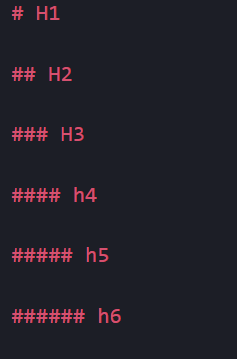
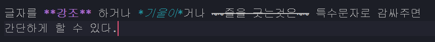
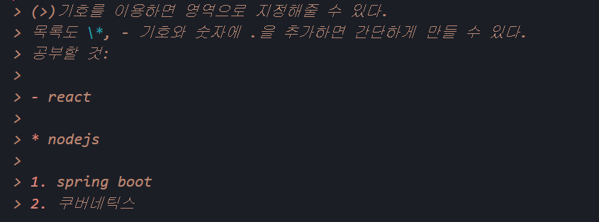
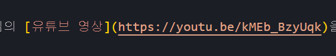
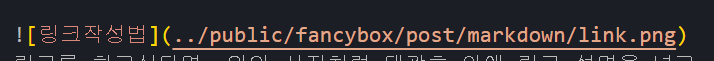
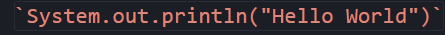
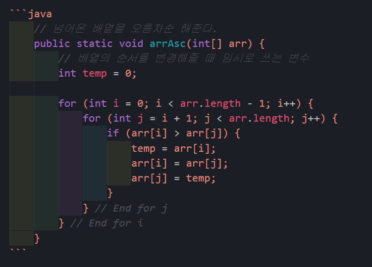

# 본격적으로 블로그 작성하기 위한 MarkDown 연습

## MarkDown이란?

일반 텍스트 기반의 경량 마크업언어로 문법이 쉬워 잠깐만 배워도 사용할 수 있고 별다른 에디터 기능들이 없어도 에디터를 사용한 것 같은 문서를 만들 수 있다.  
Github에서 Readme.md 파일이 MarkDown 파일이기 때문에 블로그를 하지 않는다고 하더라도 학습하면 좋다.

---

## 기본적인 문법

### 제목설정

#은 HTML의 H1으로 #의 개수에 따라 `H1~H6`처럼 그 크기가 달라지고 `#`한개만 사용한다면 라인이 추가가된다.
  
위에 처럼 입력하면 아래 결과가 나온다.

# H1

## H2

### H3

#### h4

##### h5

###### h6

---

### 라인넣기

만약 H1 없이 라인을 넣고싶다면 `___`를 입력하면 된다.

---

### 글자강조


글자를 **강조** 하거나 *기울이*거나 ~~줄을 긋는것은~~ 특수문자로 감싸주면 간단하게 할 수 있다.

---

### 단락, 리스트 만들기



#### 위와 같이 입력하면 아래와 같이 나온다.

> (>)기호를 이용하면 영역으로 지정해줄 수 있다.  
> 목록도 \*, - 기호와 숫자에 .을 추가하면 간단하게 만들 수 있다.  
> 공부할 것:
>
> - react
>
> * nodejs
>
> 1. spring boot
> 2. 쿠버네틱스

---

### 링크, 이미지 넣기

  
링크를 하고싶다면 위의 사진처럼 대괄호 안에 링크 설명을 넣고 소괄호 안에 링크할 url을 입력하면 된다.
  
이미지의 경우 링크와 동일한 방법이지만 앞에 !를 붙여주면 된다.

---

### 테이블

```
|제목|내용|작성자|
|:--:|:--:|:--:|
|td|td|td|
|td|td|td|
```

위처럼 입력하면 아래같이 테이블 형태로 볼 수 있다.  
:표시를 --앞에두면 왼쪽정렬, 뒤에두면 오른쪽 정렬, 양쪽에 두면 가운데 정렬이 된다.
|제목|내용|작성자|
|:--:|:--:|:--:|
|td|td|td|
|td|td|td|

---

### 코드입력


간단한 한줄짜리 코드라면 `System.out.println("Hello World")` \`를 이용하여 강조할 수 있다.  

코드를 여러줄 넣는다면 \`\`\`를 로 감싸주면 된다.  
거기다 코드에 해당하는 언어를 표시해주면 해당 코드에 맞게 변수같은건 색을 입혀준다.(나는 자바코드를 넣었기 때문에 java를 입력해주었다.)

```java
    // 넘어온 배열을 오름차순 해준다.
    public static void arrAsc(int[] arr) {
        // 배열의 순서를 변경해줄 때 임시로 쓰는 변수
        int temp = 0;

        for (int i = 0; i < arr.length - 1; i++) {
            for (int j = i + 1; j < arr.length; j++) {
                if (arr[i] > arr[j]) {
                    temp = arr[i];
                    arr[i] = arr[j];
                    arr[j] = temp;
                }
            } // End for j
        } // End for i
    }
```

---

### 업무 목록

```
- [x] 오늘 커밋
- [ ] 책 1챕터 읽기
- [ ] 강아지와 산책
```

위와 같이 입력하면 아래처럼 체크박스화 되어 readme파일에서 업무목록을 만드는 용도로 사용이 가능하다.

- [x] 오늘 커밋
- [ ] 책 1챕터 읽기
- [ ] 강아지와 산책

---

### 개행

이글을 작성 중에 개행이 되지 않아 불편하였는데 `<br>`을 이용하거나 공백을 두번 주면 개행이 된다.

---

이 문서는 드림코딩 엘리님의 [유튜브 영상](https://youtu.be/kMEb_BzyUqk)을 보고 작성하였다.
