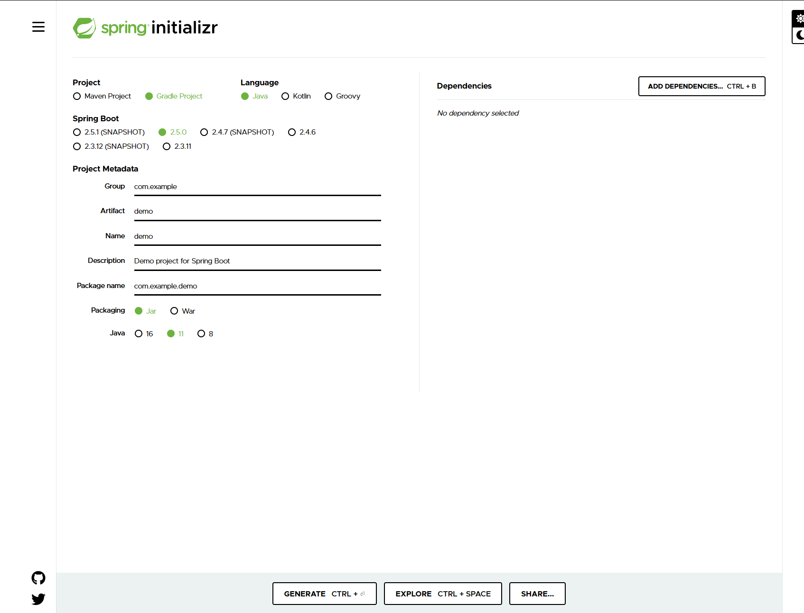

# Spring Boot 입문

## Spring Boot 프로젝트 셋팅법

일반적으로 Spring Boot프로젝트는 start.spring.io 에서 셋팅해준다.
프로젝트 라이브러리 관리는 과거에 Maven을 많이 사용했지만 Gradle로 해준다.  
그렇기 때문에 Gradle로 셋팅해준다.

<!--TODO Gradle과 Maven의 특징 조사하기 -->



버전을 고를 수 있는데 SNAPSHOT가 붙어있는 것은 아직 만들고 있는 버전이다. M1같은게 적혀 있다면 정식 릴리즈 버전이 아니기 때문에 아무것도 붙어있지 않은것을 선택해준다.  
Group는 기업명 또는 도메인명을 적어준다.  
Artifact는 빌드되어 나오는 결과물이다.

Project Metadata를 전부 적어주었다면
Dependencies에서 초기 라이브러리 셋팅을 해줄 수 있다.
web 프로젝트를 개발하기 때문에 spring web을 선택해준다.
일반적으로 스프링 레거시 환경에선 jsp에 jstl을 사용했지만 스프링 부트에선 Thymeleaf를 사용한다.

스프링 레거시 시절에는 스프링이 굉장히 불편했지만 스프링 부트가 나오면서 매우 편해졌다.

<!-- vscode에서 프로젝트 build.gradle 불러오는 것까지 설명 및 스크린샷 -->

build.gradle를 열었으면 가장 위에 plugins가 있다.  
여기서는 우리가 사용하는 스프링 부트의 버전이나 사용할 언어인 java같은것을 설정한다.  
아래 group는 적어주었던 프로젝트 그룹이고 버전은 해당 프로젝트가 배포될 경우에 버전을 의미한다. 이제 생성되었으므로 0.0.1로 시작된다.  
souceCompatibility는 자바의 버전을 보여준다.  
repositories는 아래 dependencies에서 지정한 라이브러리를 다운받는 장소를 지정하는 곳이다.
dependencies는 스프링 레거시에서 메이븐을 사용해본 사람들은 전부 알겠지만 이번 프로젝트에 포함 될 라이브러리들을 지정해주는 것이다.
<br>

스프링의 경우 굉장히 큰 프레임워크이기 때문에 깃에 올릴경우 빼야할 부분들이 많다. 또한 서버나 DB정보, 또는 api연동 키같은 개인정보 같은것들도 빼줘야하는데 이런경우 .gitignore를 작성하여 뺄 항목을 잡아주어야 한다.  
spring boot를 오면서 위처럼 프로젝트를 다운받으면 이런 .gitignore가 자동으로 작성되어 있어 따로 작성하는 불편함이 해소되었다.
<br>

스프링 부트의 경우 스프링과는 다르게 Application 클래스에 main메서드가 존재하고 이걸 동작시킴으로서 서버가 구동되면서 실행된다.

<!-- vscode에서 프로젝트를 구동시키고 에러나는 페이지를 보여줌 -->

에러가 발생하지만 놀랄필요는 없다. 아무것도 작업하지 않았기 때문에 에러가 난것이다. 서버만 구동되었다면 성공이다.

---

## 라이브러리

<!--TODO 라이브러리 스샷 -->

build.gradle에 선언한 dependencies는 3개뿐이 안된다.  
하지만 막상 프로젝트에 불러온 라이브러리를 살펴보면 정말 많이 불러와있다.
프로젝트에 spring web, Thymeleaf를 불러오지만 이 두개의 기능을 사용하기 위해 필요한 의존 관계 라이브러리가 굉장히 많기 대문에 모두 프로젝트에 설치하게 된다.  
설치 된 라이브러리 중 srping-boot-starter-tomcat이 존재하는데 이는 was를 따로 설치하지 않아도 프로젝트만 실행시키면 자동으로 내장된 서버를 구동시켜 웹 사이트를 띄워준다.

<!--TODO srping-boot-starter-tomcat 설명 -->

다음으로 눈여겨 볼만한 라이브러리는 로그와 관련된 것이다. 보통 sysout를 많이 사용하지만 실무에선 로그를 사용해야 분류해서 볼 수 있기 때문에 로그를 사용해야 한다. spring boot 에선 요즘 많이 사용하는 logback과 slf4j를 기본으로 설치하도록 제공해준다.

<!--TODO logback과 slf4j대한 설명  -->

---

## 화면구현

메인화면을 index파일로 만들어주는건 왠만한 웹 언어의 공통이다. spring boot를 사용해도 마찬가지이다.  
[main]-[resources]-[static] 경로에 `index.html`파일을 만들어 주면 서버를 실행했을때 해당 페이지에 작생해준 html코드들이 작동한다.
spring boot도 spring이기 때문에 기존의 mvc패턴으로 경로를 잡아주면 된다.  
main에 java안 패키지에 controller패키지를 만들어주고 해당 폴더에 controller 파일을 만들어주어 test경로로 test메서드를 만들어준다.  
스프링과 같게 model에 데이터를 넣어주고 리턴문자를 경로 + html파일명으로 잡아주면 해당 문서파일을 뷰파일로 잡아준다.  
이제 test.html을 만들어주고 상단에 html태그에 `<html xmlns="http://www.thymeleaf.org">`로 작성해주어 thymeleaf를 사용해준다.
`<p th:text="'안녕하세요. ' + ${data}" />` html에 이와 같이 thymeleaf 문법으로 작성해준다면 `${data}`부분에서 우리가 model에 입력해주었던 data객체를 불러올 수 있다.

---

## 스프링 프로젝트의 구조

> 웹을 개발함에 있어 3가지 방식으로 개발이 진행된다.
>
> 1. 정적컨텐츠 : 서버에서 작업없이 에서 바로 파일을 보여주는 것이다.
> 2. MVC와 템플릿 엔진 : 서버에서 동적으로 작업을 한 뒤 보여주는 것을 템플릿 엔진(jsp, php등)이라고 하고 서버에서 비지니스 작업을 모두 하기 위해 MVC패턴을 사용한다.
> 3. API : 안드로이드 또는 아이폰 등 모바일 플랫폼을 개발할 때 VIEW가 아닌 JSON형태로 데이터만 보내주는것을 API방식이라고 한다.

### 정적컨텐츠

정적 컨텐츠는 영어로 바꾼 static폴더안에 생성해주는 파일들을 말한다.
위에서 test.html을 만들어줄때 경로인데 이 안에는 정적 컨텐츠들을 넣어주면 된다.  
대신 프로그래밍은 불가능 하고 css, js, image등 정적인 데이터들은 여기에 정리해주면 된다.

### MVC와 템플릿 엔진

MVC는 M(Model), V(View), C(Controller)을 의미한다.  
아주 예전에 웹 개발에서는 php나 jsp파일 하나에서 View는 당연하고 DB와 접속하여 데이터를 받아오는것 부터 비지니스 로직 같은 모든것들을 처리해줬다.  
현재는 JSP, 또는 템플릿 엔진에서는 View부분만 처리해주고 Model에서 DB의 데이터를 전달해주는 역할 컨트롤러가 요청을 제어하여 비지니스 로직에 연결해주고 이를통해 모델에 DB데이터를 작업해준다.

### API

컨트롤러에서 값을 리턴해줄 때 일반적으로는 view페이지로 리턴을 해주게 된다.  
API의 경우 view가 아닌 데이터를 보내줘야 하는데 이를 위해`@ResponseBody`라는 어노테이션을 추가하여 리턴하는 값이 http에 body부분에 직접 삽입되어 간다는걸 컴파일러에게 알려주어야 한다.  
일반적인 Ajax같이 간단하게 결과만 리턴받는다면 String를 리턴받아 하나의 문자열만 사용하는 경우가 많은데 API의 경우에는 리턴타입으로 VO를 지정해준다면 VO에 입력된 데이터가 JSON으로 자동변환되어 리턴되어진다.

---

## 백엔드 개발

### 비지니스 요구사항 정리

웹 어플리케이션의 계층구조

데이터 : ID, 이름, 연락처, 나이, 메일주소
기능 : 등록, 수정, 삭제, 리스트  
아직 DB는 결정되지 않음
컨트롤러 : 웹 mvc의 컨트롤러 역할(url요청과 비지니스 로직은 제어해준다.)  
서비스 : 핵심 비지니스 로직을 작업해준다.  
레포지트리 : 데이터 베이스와 연동하여 도매인 객체를 DB로 저장시키던가 도메인객체에 DB데이터를 받아온다.  
도메인 : 비지니스 도메인 객체(여기서는 회원 도메인이 생길것이다.)

### 도메인, 레포지트리 생성

도메인 즉 VO는 그냥 변수들을 private로 만들어주고 getter and setter로 데이터를 입출력할 수 있도록만 해주면 된다.  
레포지트리 같은 경우 리턴타입에 Optional을 사용해주는데 JAVA8에 추가된 기능으로 리턴되는 값들의 Null을 처리해 주는용도로 사용된다.

<!--TODO Optional설명 -->

```java
@Override
public Optional<UserVO> findByName(String name) {
    return store.values().stream().filter(UserVO -> UserVO.getUserName().equals(name)).findAny();
}
```

<!-- 위의 구문 설명 -->

---

이 문서는 김영한 님의 인프런 강의인 스프링 입문를 보고 작성하였습니다.
